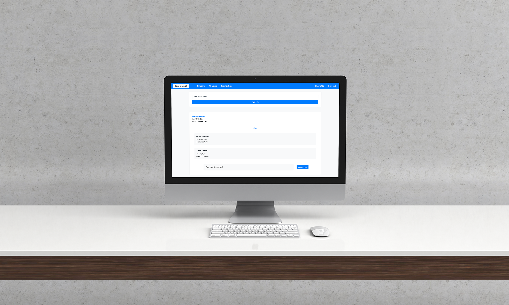

# Ruby on Rails social media app


## Library Directory 📙

| Contents                    |
| --------------------------- |
| [Live Demo](#live-demo)     |
| [Screenshots](#screenshots) |
| [Built With](#built-with-🛠) |
| [Install](#install-⏳)      |
| [Testing](#testing-⚙️)      |
| [Authors](#authors)         |
| [License](#license)         |

## Description

> Stay In Touch is a social media app, where a user can create an account, send & accept friend requests and add posts, comments, and likes. This project was built using Ruby On Rails and deployed on Heroku.

## Live Demo

[Heroku link](https://fathomless-temple-93868.herokuapp.com/)

## Screenshots



## Built With 🛠

```
- Ruby 2.6.3
- Ruby on Rails 5.2.4.4
- VS Code
```

## Install ⏳

> Follow these steps below to get my Application working

1. - [ ] Open your `Terminal`
2. - [ ] Navigate to the directory where you will like to install the repo by running `cd FOLDER-NAME`
3. - [ ] Run `git clone git@github.com:DcRonan/ror-social-scaffold.git` to download <b>or</b> you can download using `HTTPS` by running `git clone https://github.com/DcRonan/ror-social-scaffold.git` in the terminal
4. - [ ] Run `cd ror-social-scaffold` to enter directory
5. - [ ] Run `bundle install` to install Ruby Gems (<b>hint:</b> Mac users, if not working then run `sudo bundle install`)
6. - [ ] Run `rails db:create` to create a local database
7. - [ ] Run `rails db:migrate` to migrate the database
8. - [ ] Run `http://localhost:3000/` in your browser to start the application

## Testing ⚙️

> I have used [rspec](https://rspec.info/) testing tool to test the code by creating many test cases. Please follow below to test my code

1. - [ ] Open `Terminal` again
2. - [ ] Run `cd ror-social-scaffold` to enter directory
3. - [ ] Run `rspec` to start testing
4. - [ ] All tests will pass ✅

## Authors

### 👨‍💻 Khalil Hamdi

[](https://github.com/khalilhamdii) <br>
[](https://www.linkedin.com/in/khalilhamdi/) <br>
[](mailto:khaalil.hamdi@gmail.com) <br>
[](https://twitter.com/Khalilhamdiii)

### 👨‍💻 Daniel Ronan

[](https://github.com/DcRonan) <br>
[](https://www.linkedin.com/in/danronan10/) <br>
[](mailto:danielconnorronan@gmail.com) <br>
[](https://twitter.com/dc_ronan)

### Acknowledgments 🌟

[Microverse](https://github.com/microverseinc/ror-social-scaffold)

### 🤝 Contributing

Contributions, issues and feature requests are welcome!

Feel free to check the [issues page](https://github.com/DcRonan/ruby-slack-bot/issues).

### Show your support

Give a ⭐️ if you like this project!

### License


